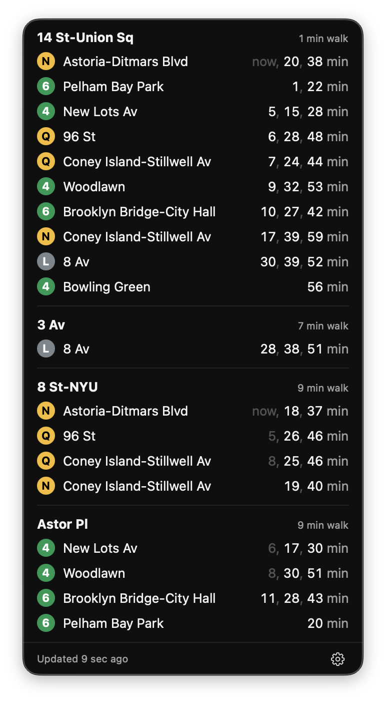

# Train Timer

**NYC Subway arrivals in your Mac's menu bar.** It finds the station nearest you and shows when the
next trains come. Click for every line at the four closest stations.

<p align="center"></p>

- **Glanceable:** the menu bar shows the next trains you can still make, like `🚇 6 1m · 4 5m`.
- **Every line nearby:** each route and direction at the four closest stations, with walking time.
  Transfer complexes like Times Sq count as one station.
- **Knows you have to walk:** trains that leave before you could get to the platform are dimmed.
- **Live MTA data:** realtime feeds refreshed every 30 seconds, including late-night and weekend reroutes.
- **Private:** your location never leaves your Mac. See [Privacy](#privacy).
- **Tiny:** native SwiftUI, about 2 MB, no accounts or API keys.

## Install

Requires macOS 14 Sonoma or later (Apple Silicon or Intel).

1. Download **TrainTimer-x.y.z.dmg** from [Releases](https://github.com/eardatasci/traintimer/releases/latest).
2. Open it and drag **Train Timer** into **Applications**.
3. Open Train Timer. Because it isn't notarized by Apple (see below), macOS blocks it the first time:
   click **Done**, then go to **System Settings → Privacy & Security**, scroll down, and click
   **Open Anyway** next to the message about Train Timer.
4. Allow location access when asked.

Or skip step 3 from Terminal: `xattr -dr com.apple.quarantine /Applications/TrainTimer.app`

To keep it running, open the menu and choose ⚙︎ → **Open at Login**.

> **Why the warning?** Apple only skips it for apps signed with a paid Developer ID. Train Timer is a free,
> open-source side project. You can read every line and [build it yourself](#build-from-source).

## Privacy

- Location is used on-device only, to pick the nearest stations.
- The app downloads the MTA's line-level feeds (e.g. "all ACE trains"), which every rider gets. Nothing
  about where you are is sent anywhere.
- Once a day it asks GitHub whether a newer version exists. No analytics, no tracking.

## Build from source

Needs Xcode 26 or later (for the Icon Composer app icon).

```sh
git clone https://github.com/eardatasci/traintimer && cd traintimer
open TrainTimer.xcodeproj        # then Run, or:
./scripts/install.sh             # build Release into /Applications
```

Pin a fixed location instead of using Location Services:

```sh
defaults write com.eardatasci.TrainTimer fixedLocation "40.7347,-73.9906"
defaults delete com.eardatasci.TrainTimer fixedLocation
```

## How it works

- **Stations** come from the MTA's [Subway Stations](https://data.ny.gov/Transportation/MTA-Subway-Stations/39hk-dx4f)
  dataset, bundled in the app. Refresh it with `./scripts/update-stations.sh`.
- **Arrivals** come from the MTA's [GTFS-Realtime feeds](https://api.mta.info/#/subwayRealTimeFeeds), decoded by
  a small hand-written protobuf reader (no dependencies). The app polls only the feeds serving nearby
  stations. Every 5 minutes it checks all eight feeds, so trains running on other lines' tracks still show up.
- **Walking time** is straight-line distance stretched 30% for the street grid, at 80 m/min.

| Path | What |
| --- | --- |
| `TrainTimerCore/` | Swift package with all the logic: GTFS-RT decoding, stations, feeds, departure boards. `swift test` |
| `App/` | The SwiftUI `MenuBarExtra` app: location, polling, UI. |
| `App/AppIcon.icon` | Icon Composer icon. Its layers are drawn by `scripts/make-icon.swift`. |
| `project.yml` | [XcodeGen](https://github.com/yonaskolb/XcodeGen) spec. Run `xcodegen generate` after adding files. |

## Releasing

1. Bump `MARKETING_VERSION` in `project.yml`, then run `xcodegen generate`.
2. Run `./scripts/release.sh` to produce `dist/TrainTimer-<version>.dmg`. Set `SIGN_IDENTITY` and `NOTARY_PROFILE`
   to sign with a Developer ID and notarize. See the script header.
3. Run `gh release create v<version> dist/TrainTimer-<version>.dmg`. The tag must be `v` + the version, because
   the in-app update check compares them.

## Credits

Train data © Metropolitan Transportation Authority. Train Timer is not affiliated with or endorsed by the MTA.
Released under the [MIT License](LICENSE).
